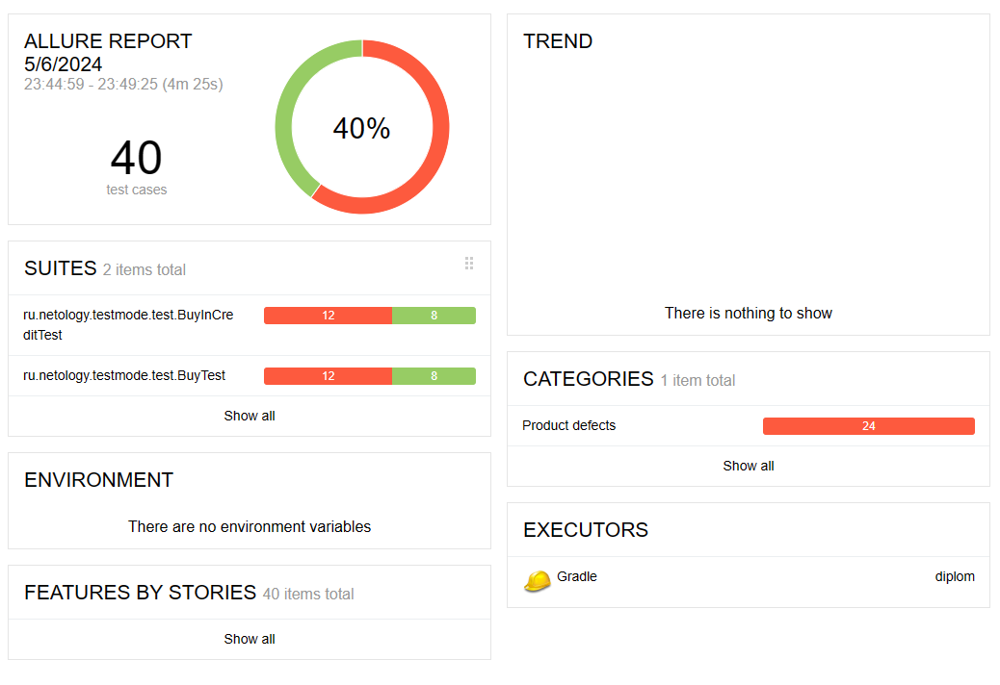

# Отчет по итогам тестирования

## Краткое описание
Произведено атоматизирование тестирование сервиса по покупке тура двумя способами: Оплата картой и Оплат в кредит по данным карты; c поддержкой двух СУБД: MySQL и PostgerSQL

## Результаты
Общее количество тестов - 40 (по 20 для каждого способа оплаты)\
Успешных тестов - 16 (40%)\
Неуспешных тестов - 24 (60%)

